# 查找

-   查找
-   查找表：用于查找的数据结构
-   关键字：区分数据的唯一标识

## 分类

静态和动态

## 评价

查找长度：需要对比关键字的次数

**ASL平均查找长度**：查找过程中，进行关键字的比较次数的平均值

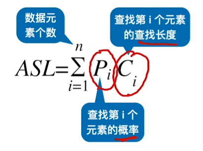

类比二排序树

## 对于二分查找

### 成功的ASL计算

每个层结点的个数 * 层数求和

1 + 4 + 3 * 4 + 4 * 4

### 失败的ASL计算

从根节点到对应失败结点的父节点的路径上的节点数

圆形的是列表结点，方形的是失败结点

即 第三层有四个结点：3*4

第四层有8个结点：4*8

# 顺序查找

$\frac{n + 1}{2}$

`for i in range(n):`

## 哨兵模式

-   下标从1开始
-   把目标元素放到a[0]
    -   a[i] == a[0]
-   从后往前遍历

# 二分查找

-   相当于一颗平衡二叉树

$log_2(n+1)$

-   有序
-   顺序表

~~~
int l = 0,r = n
while (l < r)
    int mid = l + r >> 1;
    if(a[mid] >= x) r = mid;
    else l = mid + 1
~~~

~~~
int l = 0,r = n
while (l < r)
    int mid = l + r + 1 >> 1;
    if(a[mid] <= x) l = mid;
    else r = mid - 1
~~~

~~~

while (l <= r)
{
    int mid = l + r >> 1;
    if (q[mid] >= x) r = mid - 1;
    else l = mid + 1;
}
if (q[l] != x) cout << "-1 -1" << endl;
else
{
    cout << l << ' ';
    int l = 0, r = n - 1;
    while (l <= r)
    {
        int mid = l + r + 1 >> 1;
        if (q[mid] <= x) l = mid + 1;
        else r = mid - 1;
	}
cout << r<<endl;
~~~

# 分块

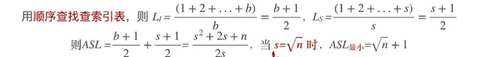

最下的时候，分成$s = \sqrt{n}时最下时ASL  = \sqrt {n} + 1$

-   
-   块内无序
-   块间有序

上一级存最大key和区间

-   先确定分块
-   再顺序查找

# 二叉排序树

-   左子树 < 根 < 右子树
-   递归满足

-   **中序遍历**可以获得有序的序列

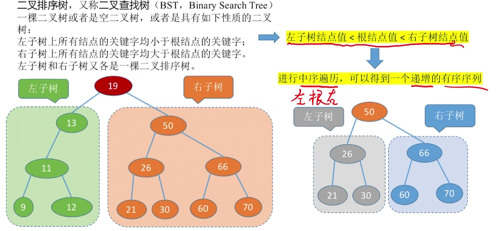

-   不同的插入顺序会得到不同的二叉排序树

-   ASL：

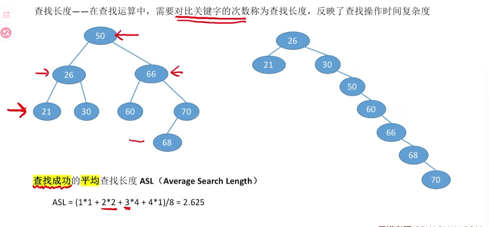

## 查找操作

~~~
root 
if(root.data > x)
	root = root.lchild
else:
	root = root.rchild;
	

~~~

### 代码

~~~
BSTNode *BST_Search(BSTree T,int key)
{
	while(T != NULL && Key != T -> key)
	{
		if(key < T->key) T = T->;child;
		else T = T -> rchild;
	}
}
~~~

~~~
BSTNode *BST_Search(BSTree T,int key)
{
	if(T == NULL)
		return NULL;
	if(key == T->key)
		return T;
	else if(T -> key > key)
		return BST_Search(T -> lchild,key);
	else BST_Search(T -> rchild,key);
}
~~~

## 插入

~~~
int BST_Insert(BSTree &T,int k)
{
	if(T == NULL){// 新插入为根
		T = (BSTree)malloc(sizeof(BSTNode));
		T -> key = k;
		T -> lchild = T -> rchild = NULL;
		return 1;
	}
	else if(k == T -> key)
		return 0; // 相同的数字
	else if(k > T -> key)
		return BST_Insert(T -> lchild,k); // 插入到左子树
	else:
		return BST_Insert(T -> rchild,k)
		// 插入到右子树
}
~~~

## 删除

-   叶子结点，直接删除
-   若只有右子树（左子树），直接让子节点替代就可以了

-   若都有，需要找到右子树，中序遍历的第一个树（最小的树）替代需要删除的结点
    -   此时因为是最左下的结点，一定没有左子树
    -   就可以直接用子节点替代自己

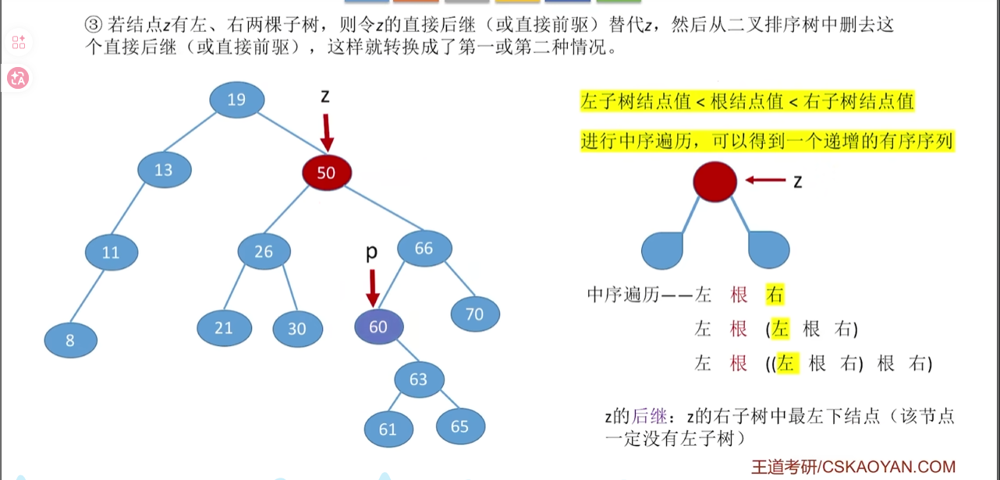

# 平衡二叉树AVL

-   主要的问题是怎么保证平衡

-   平衡因子

-   树上任意结点的左子树和右子树高度之差不超过1

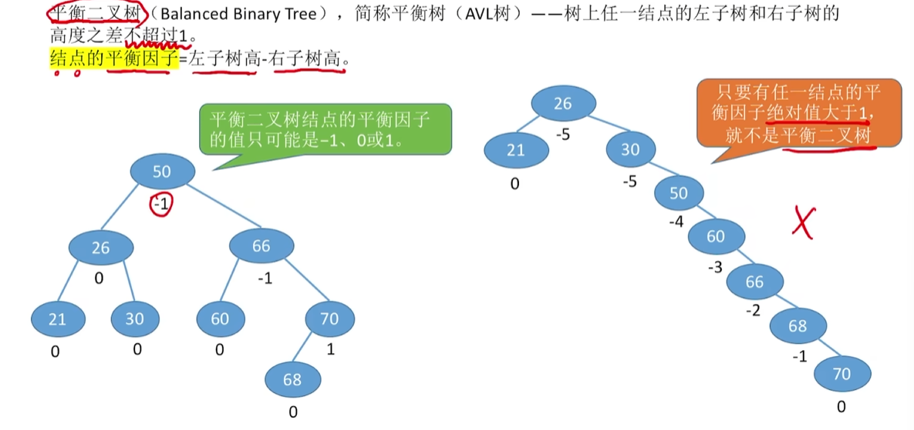

## 插入

当插入数据时，一整条查找路径的结点都会受到影响，

我们向上找，找到第一个不平衡的结点，调整这个不平衡子树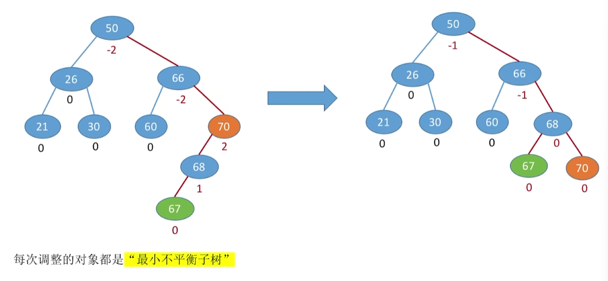

## 调整

### LL型

把B右旋，B作为根节点，A作为右子树

~~~
gf ->A(f) -> B(p)

f -> lchild = p -> rchild;
p -> rchild = f;
gf ->child = p;
~~~

### RR型

B左旋，B作为根，A作为左子树

~~~
f -> rchild = p -> lchild;
p -> lchild = f;
gf -> child = p;
~~~

### LR型

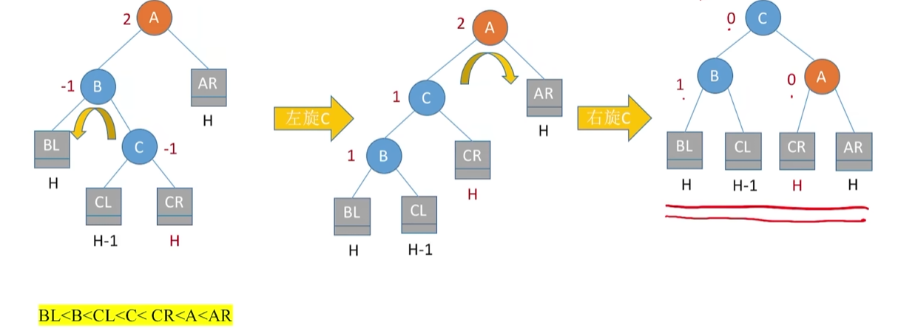

C左旋右旋

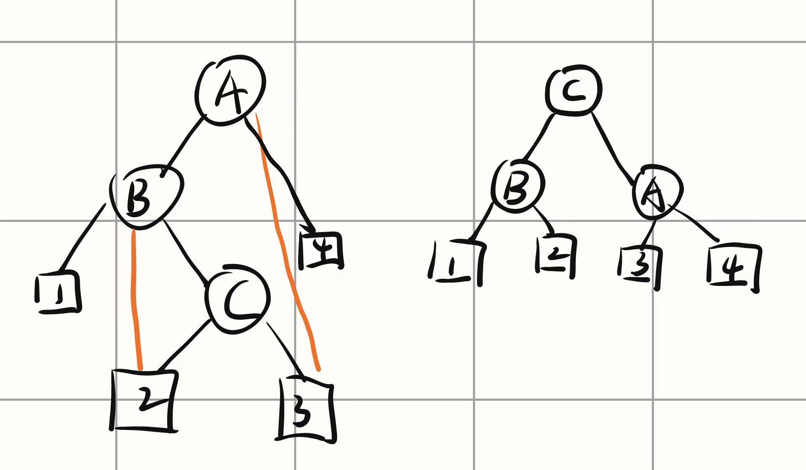

### RL型

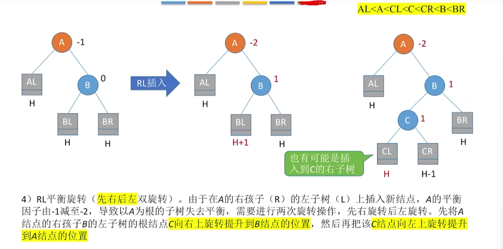

-   C右旋左旋

### 总结

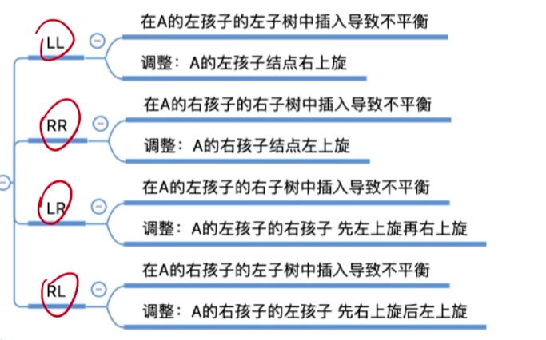

-   只有左孩子才会右旋
-   右孩子可以左旋

## 删除

### 叶子结点

直接删除

### 1

-   和插入操作类似

-   找到最小的不平衡子树
-   找到最高的儿子和孙子

10是最高的儿子

20是最高的孙子

# 红黑树RBT

-   因为在删除和插入的时候会影响平衡二叉树的形态，需要频繁调整（平衡容易破坏）
-   每次需要重新计算平衡因子，找不平衡子树
-   RBT不需要

---

平衡二叉树：适用于以查为主、很少插入/删除的场景
红黑树：适用于频繁插入、删除的场景，实用性更强

---

 ## 定义

是一种优化的二叉排序树

左 < 根 < 右

~~~
struct RBnode{
	int key;关键字的值
	RBnode* parent; 父节点指针
	RBnode* lChild; 左孩子指针
	RBnode* rchild; 右孩子指针
	int color;结点颜色
}

黑高BH：从某个结点出发，达到任意空叶节点的路径上的黑节点的总数
~~~

-   每个结点是红色或者黑色
-   根节点是黑色==根黑==
-   叶节点（外部节点，NULL结点，失败节点）都是黑色
    ==叶黑==
-   不存在两个相邻的红色结点(父子一定不是双红，兄弟可以是)==双红==
-   每个节点，从该节点到任意叶节点的路经上，黑节点的数目相同==相同==

 

## 性质

1.   根节点到叶节点的最长路径不大于最短路径的两倍

     -   根节点到叶节点黑色数目相同

     -   任意多的方式就是中间会穿插红色，同时他不可能多余一倍

2.   有n个内部节点，H = $2log_2(n+1)$
     -   查找操作O（logn)

## 查找

-   与二叉排序树和平衡树是相同的

## 插入

-   先查找确定位置
-   为根：黑色
-   非根：红色（保证黑路同，到达任意叶节点的黑色结点数目相同）
    -   若满足则结束
    -   不满足，需调整
    -   黑叔：旋转 染色
        -   染色染的都是刚刚更换辈分的结点
        -   LL：右单旋，父换爷    染色
        -   RR：左单旋，父换爷    染色
        -   LR：左右旋，儿换爷    染色
        -   RL：右左旋，儿换爷    染色
    -   红叔：染色加变新
        -   叔父爷染色，爷变成新节点

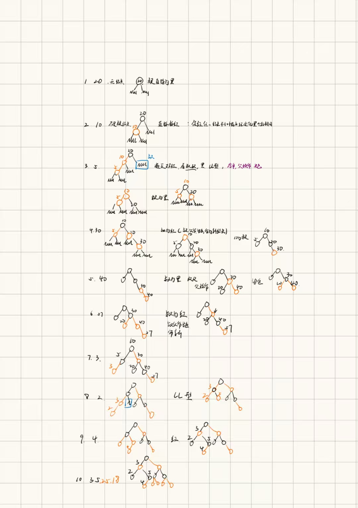

 

LR的变换方法

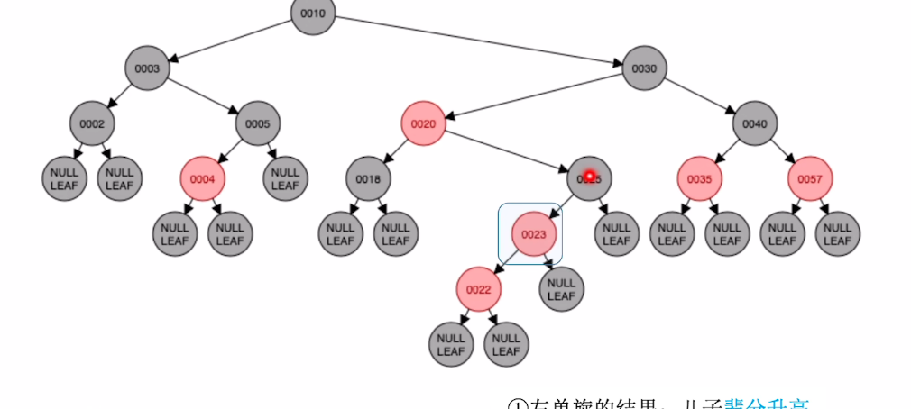

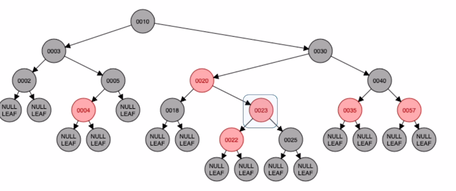

## 删除

O（logn）

和二叉排序树的删除是相同的

需要调整颜色和位置

==不考==？

# 散列表

哈希

可以通过关键字算出存储地址

-   冲突：算出了相同的值
-   同义词：两个哈希值相同的值

## 如何减少冲突

-   拉链法：把冲突存链表里
-   开放定址法：给她找个新位置

## 构造散列函数

-   散列函数必须覆盖所有可能出现的关键字
-   

### 除留余数法

散列表表长为m，取一个不大于m但最接近或等于m的质数p

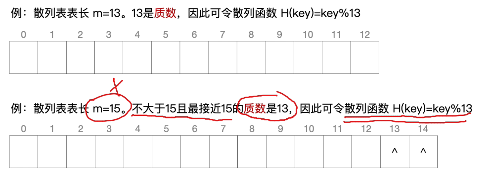

几乎是选一个最大的质数

### 直接定址法

关键字分布连续

### 数字分析法

用分布均匀的部份数当映射数

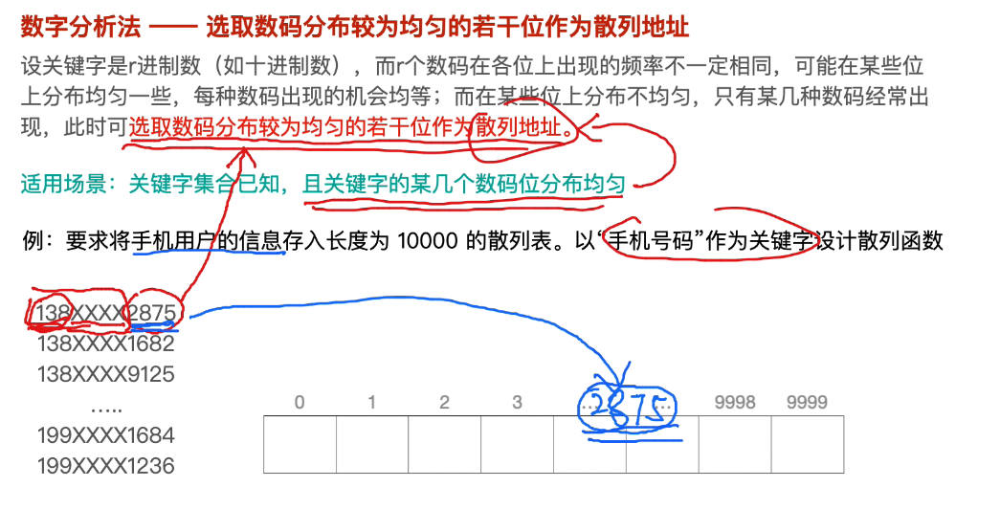

把手机号后四位作为映射

### 平方取中法

去关键字的平方值的中间几位作为散列地址

## 拉链法

默认头插法

查找长度：统计关键字的对比次数

-   选出映射值
-   去链表对比

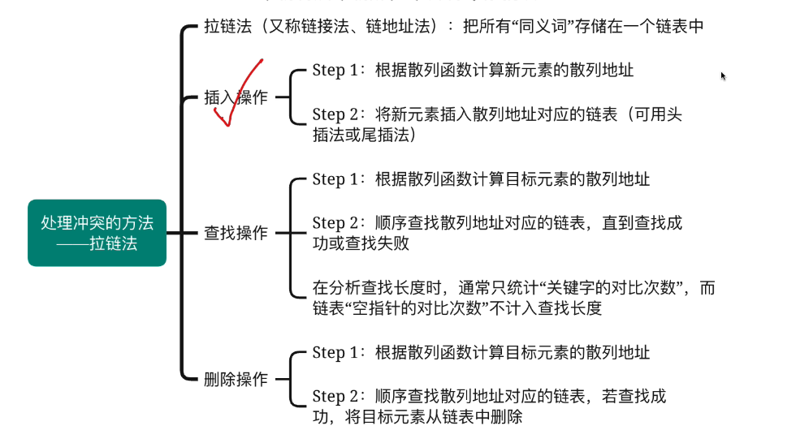

**优化：**还可以让链表变成有序的，这样可以让查找时更快

## 开放地址法

设定探测序列，

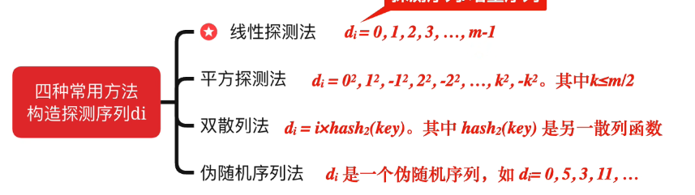

以上四种方法来设计探测序列

~~~
1 -1 2 -2 3 -3 4 -4...
~~~

$H_i = (H(key) + d_i) % m$ % m可以循环

----

d[0] = 0

-1 < d[i] < m 

---

## 分析

ASL平均查找长度

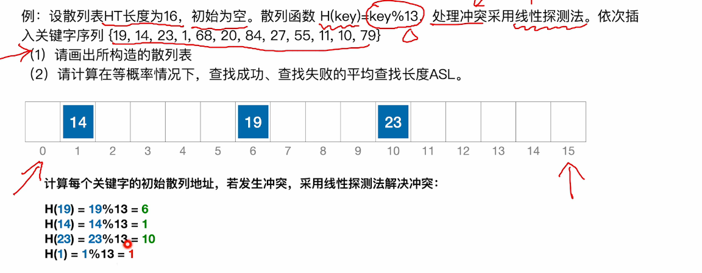

发生冲突时，线性探测

成功的：ASL = （6 + 2 + 3 + 4 + 3 + 3 + 9）/12 = 2.5

失败的：ASL

没有数字的直接是1 + ：：

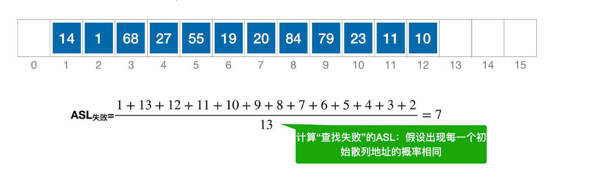

-   除以13，散列函数的取值范围是13而不是**表长**

**第三问：**删除了一个数问ASL

-   逻辑删除而不是物理删除

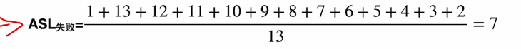

### 装填因子

表中的数/表长

因子越大，冲突越容易发生，效率会变低

### 堆积

多个数全都在一起

换一个探测法

## 总结

