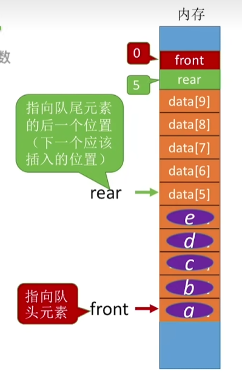
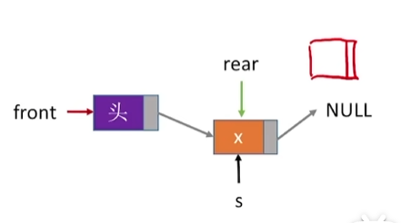
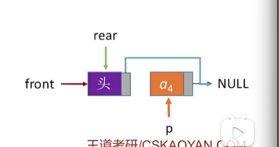

# 栈

## 定义

-   只允许一端进行插入删除操作的线性表

## 特点

-   后进先出（LIFO）

-   插入删除只能在栈顶

## 操作

### 初始化

**顺序栈**

-   顺序表存数据
-   栈顶指针指向-1

~~~
#define MaxSize 10;
typedef struct{
	int data[MaxSize];
	int top;
}SqStack;
void Init(SqStack &S){
		S.top = -1;
}
void main(){
	SqStack S;
}
~~~

### 插入

-   判断栈满
-   入栈

~~~
bool Push(SqStack &S,int e){
	if(e == MaxSize - 1)	
		return false;
	S.data[++ S.top] = e;
	return true;
}
~~~

### 出栈

-   判断栈空
-   出栈
-   返回出栈值

~~~
bool Pull(SqStack &S,int &x)
{
	if(e == -1)	return false;
	x = S.data[S.top--];
	// 先赋值再--
	return true;
}
~~~

## 共享栈

-   两个栈共享一片内存

-   设置两个栈顶指针

### 初始化

~~~
void init(ShStack &S)
{
	S.top0 = -1;
	S.top1 = MaxSize;
}
~~~

### 栈满

~~~
S.top0 + 1 = S.top1
~~~

## 链栈

头节点+头指针（逆序的方法）完美实现

~~~
typedef struct LinkNode{
	int data;
    struct Linknode *next;
}*LiStack;

~~~

## 常见题型

### 卡特兰数

如果有n个不同元素进栈，则出栈元素不同排列的个数为$$
\frac{1}{n+1}C_{2n}^{n}
$$

~~~
n = 1 ------ 1/2 * C1,2 = 1
n = 2 ------ 1/3 * C2,4 = 2
n = 3 ------ 1/4 * C3,6 = 5
n = 4 ------ 1/5 * C4,8 = 14
n = 5 ------ 1/6 * C5,10 = 42
~~~

# 队列

-   只允许一段插入另一端删除的线性表
-   先进先出

## 操作

### 初始化

~~~
#define MaxSize 10;
typedef struct{
	int data[MaxSize];
	int front,rear;
}SqQueue;

void Init(SqQueue &L)
{
	L.front = 0;
	L.rear = 0;
}
~~~

### 判空

`L.rear == Q.front`

### 已满

通过取模运算会让队列变成一个循环队列

需要**牺牲**一个元素位置，来判断是否已满

~~~
if((Q.rear + 1) % MaxSize == Q.front)
~~~

**第二种方法判断满空**

-   初始化时定义一个size记录长度

**第三种**

-   初始化时定义一个flag，每次删除操作成功时flag = 0，插入成功时flag = 1

则此时队满

`front == rear && tag == 1`

### 入队

~~~
bool EnQueue(SQList &L,int x)
{
	if((Q.rear + 1) % MaxSize == Q.front)
		return false;
	L.data[L.rear] = x;
	L.rear = (L.rear + 1 ) % MaxSize;
	return true;
}
~~~

### 出队

~~~
bool DeQueue(SQList &L,int &x)
{
	if(L.front == L.rear)
		return false;
	x = L.data[L.front];
	L.front = (L.front + 1) % MaxSize;
	return true;
}
~~~

### 队列元素的个数

~~~
(rear + MaxSize - front) % MaxSize
~~~

## 链式队列

-   设置尾指针和头指针

~~~
typedef struct LinkNode{
	INT DATA;
	struct LinkNode *next;
}LinkNode;
typedef struct{ // 队列结构体
	LinkNode *front,*rear;
}LinkQ;
void Init(LinkQ & L)
{
	Q.front = Q.rear = (LinkNode *)malloc(sizeof(LinkNode));// 指向头节点
	Q.front -> next = NULL;
}
~~~

-   判空

~~~
带头节点
if(L.front == L.rear)

不带头节点时
init
Q.front = Q.rear = NULL;
if(Q.front == NULL)判空
~~~

### 入队

-   带头结点

~~~
void EnQueue(LinkQ & Q,int x)
{
	LinkNode *s = (LinkNode *)malloc(sizeof(LinkNode));
	s -> data = x;
	s -> next = NULL;
	Q.rear -> next = s;
	Q.rear = s;
}
~~~

-   不带头节点

~~~
void F(LinkQ &Q,int x)
{
	LinkNode *s = (LinkNode *)malloc(sizeof(LinkNode));
	s -> data = x;
	s -> next = NULL;
	if(Q.front == NULL) // 对于头节点需要特殊操作
	{
		Q.front = s;
		Q.rear = s;
	}
	else{
	Q.rear -> next = s;
	Q.rear = s;
	}
}
~~~

### 出队

-   带头节点	
    -   申请要释放的节点
    -   修改头节点指针（跳过）
    -   如果是最后一个节点需要把rear指向head
    -   释放

~~~
bool DeQueue(LinkQ &Q,int &x){
	if(Q.front == Q.rear)
		return 0 //空
	LinkNode *p = Q.front -> next;
	x = p -> data;
	Q.front -> next = p -> next;//修改头节点next指针
	if(Q.rear == p)//最后一个元素
		Q.rear = Q.front;
	free(p);
	return 1;
	
}
~~~

-   如果是最后一个节点
-   

把rear 指针从a4指向head指针

