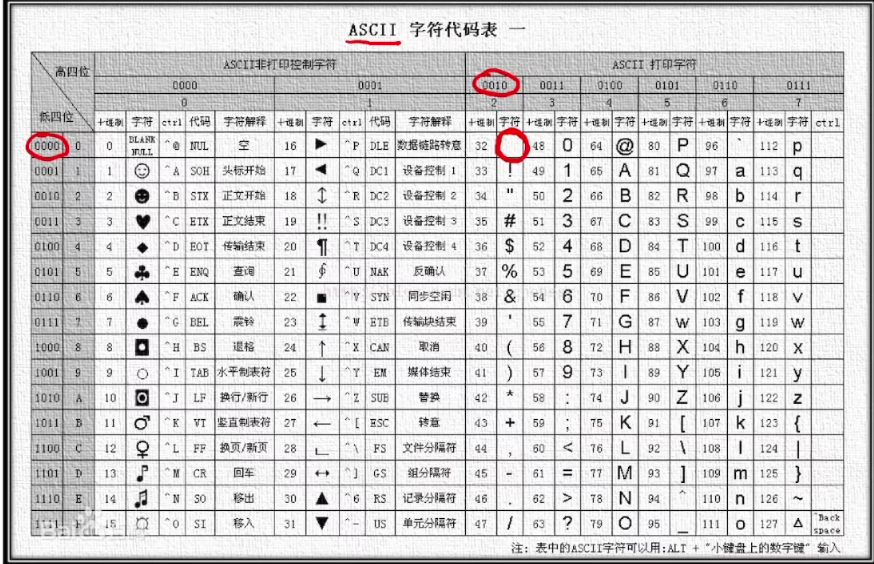
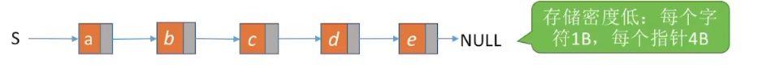
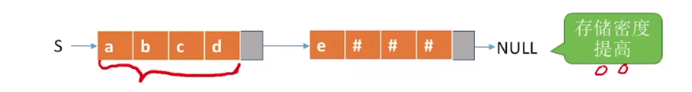

# 串定义

**默认从char[1]开始访问**

-   由字符组成的有限变量

-   子串：串中任意个连续的字符组成的子序列。
-   主串：包含子串的串。
-   字符在主串中的位置：字符在串中的序号。
-   子串在主串中的位置：子串的第一个字符在主串中的位置。

## 性质

是一个特殊的线性表

## 操作

-   赋值
-   复制
-   判空
-   len
-   清空
-   销毁
-   拼接
-   截取
-   定位
-   比较

## 字符集编码

-   英文：ASCII
-   中英文：Unicode（uft-8）

# 存储

## 顺序存储

**静态存储**

~~~
#define MaxLen 255
typedef struct{
	char ch[MaxLen];
	int length;
}SString;
~~~

**动态存储**

~~~
typedef struct{
	char *ch;
	int length;
}HString;

HString S;
S.ch = (char *)malloc(sizeof(char));
S.length = 0;
~~~

## 链式存储

~~~
typedef struct StringNode{
	char ch;
	strcut StringNode *next;
}StringNode,* string;
~~~

-   存储密度低
-   
-   一般来说一个结点存四个字符

~~~
typedef struct StringNode{
	char ch[4];
	strcut StringNode *next;
}StringNode,* string;
~~~

-   char不满，拿别的东西填("#")

# 操作

## 求子串

~~~
#include<stdio.h>
#include<string.h>

#define l 255
typedef struct String{
    char ch[l];
    int length;
}SString;

SString subString(SString &S, int st, int ed)
{
    SString ans;
    // 初始化ans
    memset(ans.ch, 0, sizeof(ans.ch));
    ans.length = 0;
    
    // 边界检查
    if(st < 0 || ed >= S.length || st > ed) {
        return ans;
    }
    
    ans.length = ed - st + 1;
    // 修正：数组下标从0开始
    for(int i = st; i <= ed; i++) {
        ans.ch[i - st] = S.ch[i];  // 这里原来是 i - st + 1，应该是 i - st
    }
    ans.ch[ans.length] = '\0';  // 添加字符串结束符
    
    return ans;
}

int main(){
    SString S;
    // 初始化S
    strcpy(S.ch, "Hello World");
    S.length = strlen(S.ch);
    
    SString result = subString(S, 1, 2);
    
    // printf不能直接打印结构体
    printf("Substring: %s\n", result.ch);
    printf("Length: %d\n", result.length);
    
    return 0;
}
~~~

## 比较子串

~~~
int f(String A,String B)
{
	for(int i = 1 ;i <= A.length&&B.length ;i ++)	
		if(A.ch[i] != B.ch[i])	
			return A.ch[i] - B.ch[i];
	return A.length - B.length// 长度更大
}
~~~

## 定位子串&&模式匹配

-   字串中找到与模式串相同的子串

~~~
主串长度为n
子串为m
一共有 n - m + 1个字串

可以爆搜 O(nm)

int Index(SString S, SString T) {
    int i = 1, n = StrLength(S), m = StrLength(T);
    SString sub;      // 用于暂存子串

    // 只要 i 没越界，就继续循环
    // n-m+1 是主串中剩余长度足以匹配模式串 T 的最后一个起始位置
    while (i <= n - m + 1) {
        // 取出从位置 i 开始，长度为 m 的子串
        SubString(sub, S, i, m);

        // 如果不相等（返回值 != 0），则继续比较下一个位置
        if (StrCompare(sub, T) != 0)
            ++i;
        else
            return i; // 返回子串在主串中的位置
    }
    return 0; // S 中不存在与 T 相等的子串
}
--------------------------------------------------------
双指针O(NM)

~~~

