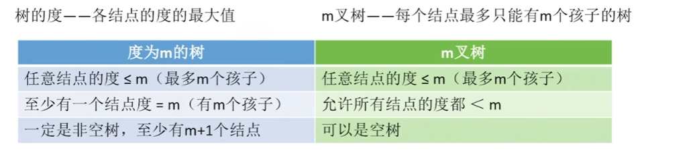
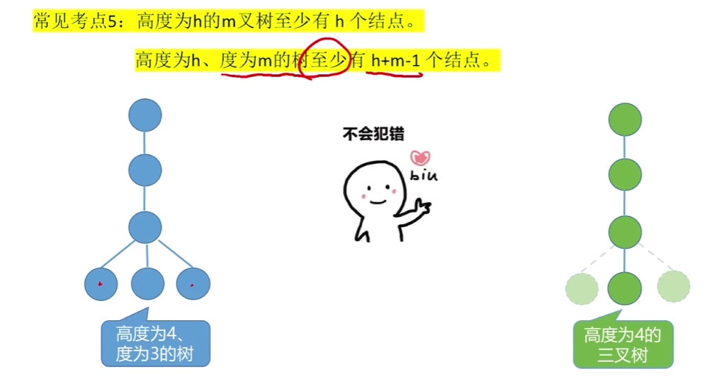
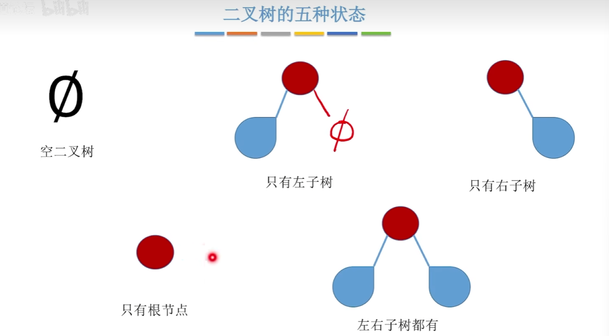
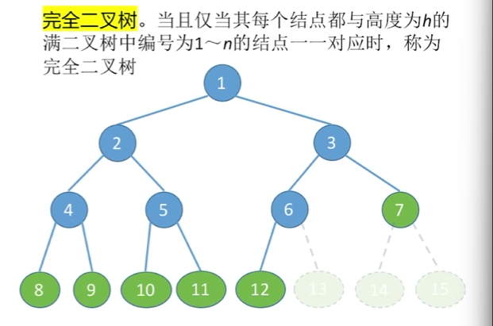
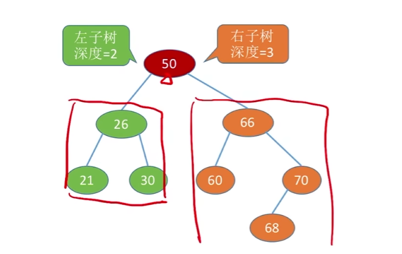
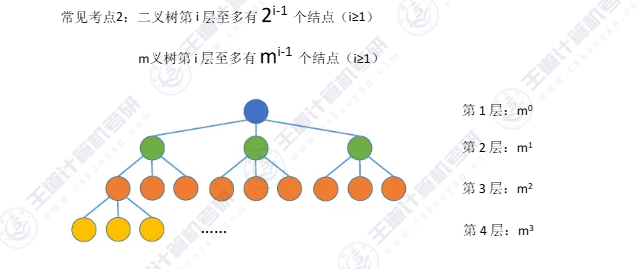

# 树

-   根结点（有且仅有一个）
-   边
-   分支节点
-   叶子节点
-   空树

-   非空树的特性：

    -   有且仅有一个根节点
    -   没有后继的结点称为“叶子结点”（或终端结点）
    -   有后继的结点称为“分支结点”（或非终端结点）

    -   除了根节点外，任何一个结点都有且仅有一个前驱
    -   每个结点可以有0个或多个后继。

## 关系描述

-   祖先节点：所有走到根节点经过的结点都是祖先
-   子孙节点：所有分支
-   双亲
-   孩子
-   兄弟
-   堂兄弟

## 属性描述

-   节点的层次（深度） -- 从上往下数
-   结点的高度（）-- 从下往上数
-   数的深度--总共多少层

-   节点的度 -- 又几个分支（孩子）

## 有序树

-   从左到右是有次序的（族谱）
-   无序的（地名）

# 森林

-   多个不相交的树的集合（m >= 0）

# 性质

-   结点数 == 总度数 + 1
-   度为m的树和m叉树

-   度为m（m叉树）的第i层至多有$m^{i-1}$个节点

 

-   高度为h的m茶树最多有$\frac{m^h-1}{m-1}$个节点

-   高度为h的m叉树至少有h个节点
-   高度为h，度为m的树至少有h + m -1个节点

-   有n个节点的m叉树最小高度为

$$
\log _m\left( n\left( m-1 \right) +1 \right)
$$

-   解方程

# 二叉树

-   是n个结点的有限集合：
-   ①或者为空二叉树，即n= 0。
-   ② 或者由一个根结点和两个互不相交的被称为根的左子树和右子树组成。左子树和右子树又分别是一棵二叉树。

## 特点

①每个结点至多只有两棵子树

②左右子树不能颠倒（二叉树是有序树）

有序树

-   可以有0个不存在两个度的节点

## 满二叉树

-   高度为h，含有$2^{h} - 1$个节点的二叉树

-   只有最后一层有叶子节点
-   不存在度为1 的节点（只有0   2）
-   按层序从1开始编号，节点i的左孩子为2i，右孩子为2i + 1；节点i的父节点为`[i / 2]`

## 完全二叉树

-   编号可以与满二叉树统一的
-   其实就是不能从中间开始少，必须从最右边少
-   只有最后两层可能有叶子节点
-   最多只有一个度为1的结点

## 二叉排序树

-   **左子树**的所有结点的关键字都**小于根节点**的关键字
-   **右子树**的所有结点的关键字均**大于根节点**的关键字
-   左右子树各是一颗二叉排序树

## 平衡二叉树

树上的任意结点的左子树和右子树深度之差不超过1

 ## 二叉树的性质

### 度为0的结点个数 = 度为2结点个数 + 1

设树中结点总数为n

~~~
n = n0 + n1 + n2
n = n1 + 2n2 + 1(书的结点个数 = 总度数 + 1)

1 - 2  === 
n0 = n2 + 1
~~~

### 第i层最多有$2^{i-1}$个结点

### 高度为h的二叉树最多有$2^h - 1$个结点

高度为h的m叉树至多有$\frac{m^h-1}{m-1}$个结点

### 完全二叉树的高度为log2(n+1)或log2n + 1

### 奇偶性

## 二叉树的存储

# 二叉树例题

先记住这四个公式

二叉树$$n_0 = n_2 + 1$$:三个节点来记忆

完全二叉树：

$h = [logn] + 1$

前k层至多有$2^k - 1$个结点

第k层至多有$2^{k-1}$个结点

## 例1

完全二叉树有1001个结点， 叶子节点有

~~~
2^10 不满
2^9  满
前9层一共2^9-1 = 511个结点
第十层1001 - 511 = 490
第十层满了是512

512-490 = 22空的
22/2 = 11第9层的叶子

~~~

