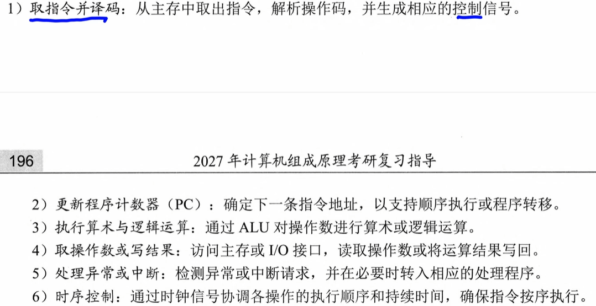

# 5 CPU中央处理器

# 5.1CPU供能和结构

## 功能

1.   执行指令
2.   检测并响应各类异常和中断的能力

1.   取值 译码 控制信号
2.   PC
3.   算数运算 逻辑运算
4.   访问主存和IO接口
5.   处理异常5.5
6.   控制指令按照顺序执行

## 结构

运算器 & 控制器

1.   执行部件 ALU
2.   寄存器
3.   控制部件
4.   中断

## CPU中各种寄存器的特点

1.   程序计数器 PC ：存放即将执行指令**内存**地址
2.   指令寄存器 IR ：暂存当前正在执行的指令（指令从主存中取出送入IR，提供给指令译码器使用）
3.   指令译码器 ID ：对IR中操作码分析，识别类型，输出译码信号
4.   通用寄存器组 GPRs ：暂存操作数，中间结果或地址指针----减少对主存的访问
5.   算数逻辑单元 ALU：执行数据运算的核心，完成算数和逻辑运算，结果送回寄存器，状态标志写入FR
6.   标志寄存器FR（也叫程序状态字寄存器PSWR），保存ALU产生的状态信息，用于条件判断与控制转移
7.   存储器地址寄存器MAR：存放当前要访问的主存地址。（地址先送入MAR再通过地址总线传送到存储器）
8.   存储器数据寄存器 MDR ： 暂存从主存中独处的数据和要写入的数据，起到缓冲与同步的作用
9.   时序信号产生部件
10.   操作控制信号形成部件
11.   总线控制逻辑
12.   中断机构：处理异常和阿文i不中断请求

## 寄存器

### 用户可见寄存器

可读 可修改：

可读不可修改：标志寄存器FR 内容有ALU运算结果自动生成

### 用户不可见寄存器

1.   指令寄存器IR
2.   存储器地址寄存器MAR 
3.   存储器数据寄存器MDR
4.   页表基址寄存器
5.   移位寄存器

# 5.2指令执行过程

指令执行完还需进行终端与异常检测

## 流程

1.   通过PC，送到MAR，送到地址总线，找到内存的某一个地址
2.   译码：知道是加法减法..
3.   未检测到中断或异常进入下一条
4.   检测到中断：
     1.   见5.5

