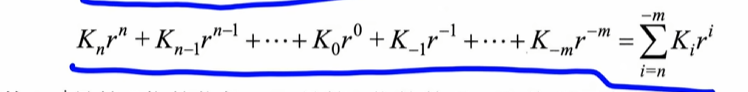
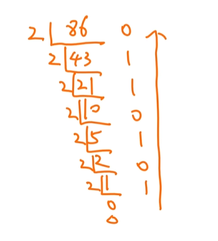

# 2数据的表示和运算

# 进制转换

1.   十进制D
2.   二进制B
3.   十六进制H   0x
4.   八进制O

## 进制的展开

## 十进制转二进制

方法：短除法一直除以2

从下往上写

~~~
对于十进制来说，/10可以得到最后一位
最先得到的是最低位
所以写的时候要逆着写
~~~

**十进制转任意进制**

就是一直 取余x，然后逆序

9000D转16进制

末尾是8，然后是2，3，到达0的时候停止，

| 0    | 1    | 2    | 3    | 4    | 5    | 6    | 7    | 8    | 9    | 10   | 11   | 12   | 13   | 14    | 15    | 16    |
| ---- | ---- | ---- | ---- | ---- | ---- | ---- | ---- | ---- | ---- | ---- | ---- | ---- | ---- | ----- | ----- | ----- |
| 1    | 2    | 4    | 8    | 16   | 32   | 64   | 128  | 256  | 512  | 1024 | 2048 | 4096 | 9192 | 16384 | 32768 | 65536 |

## 十六进制转二进制

二进制转十六进制：每四个一组，不够的去最前面补0，然后合起来

十六进制转二进制：一个数分开成四个位，展开

## 小数的二进制转换

**一直乘2，如果大于1，就给一个1，否则给0**

~~~
0.6875*2 = 1.3750 如果大于1，就给一个1   ----- 0.1
0.3750*2 = 0.75 否则给0 ----- 0.10
0.75*2 = 1.5 ----- 0.101
 ----- 0.1011
~~~

有的十进制小数不能转成二进制

---

https://www.bilibili.com/video/BV1bsoaB1EN7?t=29.5&p=5

---

