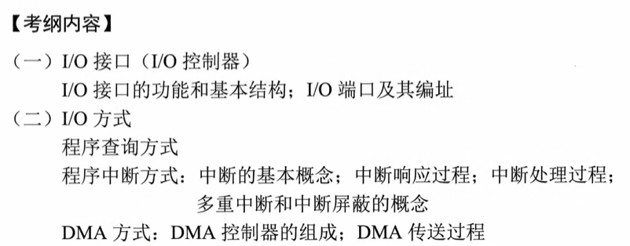
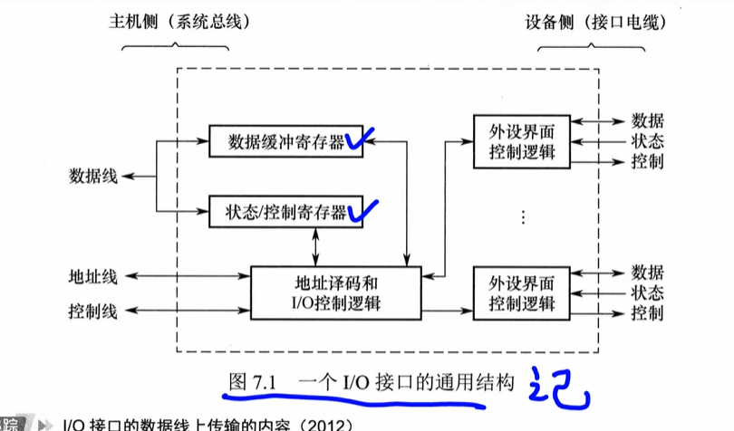
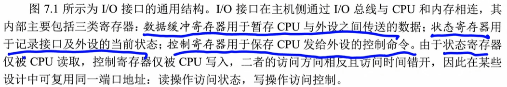
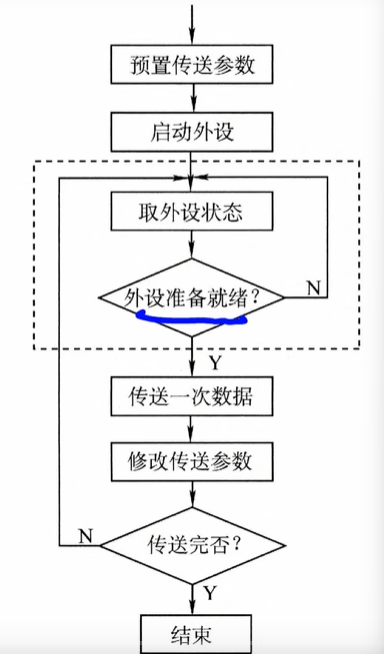
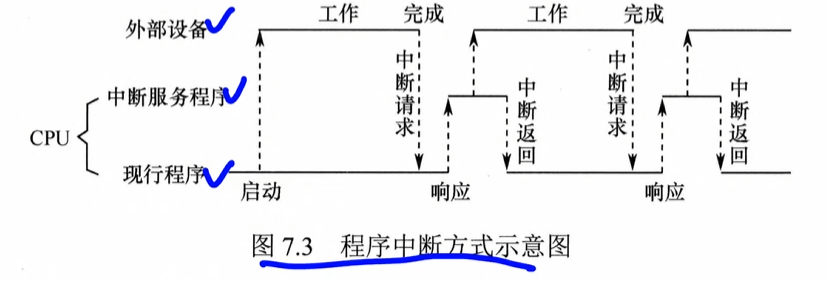
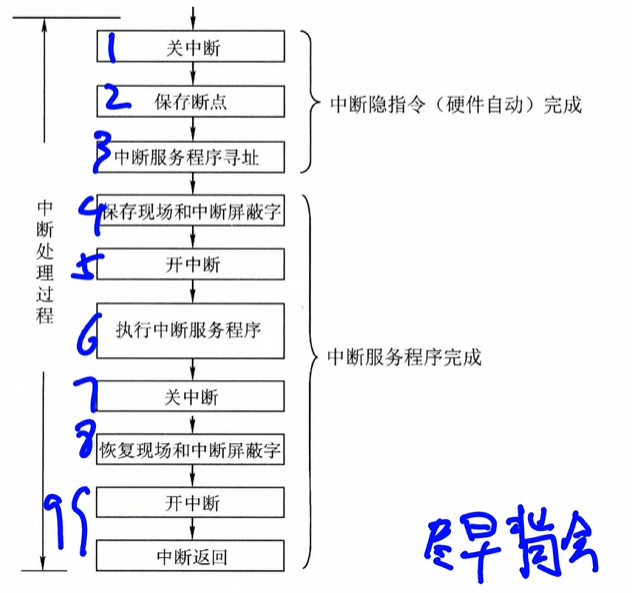

#  7 IO系统

# 7.2IO接口

IO接口（IO控制器）主机和外部设备之间的交接界面，实现二者之间的信息交换

## 功能

1.   最重要的：数据缓冲：接口中设有**数据缓冲寄存器**，用于暂存传输数据，避免速度不匹配导致的数据丢失
     1.   CPU - 接口 - 打印机，避免速度不匹配
2.   地址译码和设备选择
3.   通信联络和时序协调
4.   信号格式转换
5.   控制命令和状态信息传递：CPU通过向接口的**控制寄存器**写入命令字（如“启动”），外设通过**状态寄存器**反馈状态（如“就绪”）。

-   **三个寄存器的作用**

控制命令走的是数据线

-   **三条线的作用**
    1.   数据线传送的是读/写数据、状态信息、控制信息以及中断类型号
    2.   地址线指定要访问的I/O接口内部寄存器的端口地址
    3.   控制线传送的是读/写控制信号，以及中断请求与响应信号、总线仲裁信号和设备握手信号。
-   

## 7.2.4端口（寄存器）和编址

I/O端口是指I/O接口电路中可被CPU直接访问的寄存器

端口和接口不同

接口（通常指 **I/O 接口**）是位于 **CPU** 和 **外部设备（I/O 设备）** 之间的中间逻辑电路。

端口是接口电路内部的**寄存器**，是 CPU 与接口进行数据交换的具体地址。

1.   数据端口（支持CPU读写）
2.   状态端口（读）
3.   控制端口（写）

### 编址

1.   独立编址
     1.   独立于主存的地址空间，完全分离所以地址值可以与内存相同，
     2.   CPU通过专用的IO指令访问端口
     3.   优点
          1.   数量少于内存，地址线少，译码简单，寻址快，使用专用IO指令
     4.   缺点
          1.   功能有限，仅支持简单的数据传输，灵活性差，CPU需要提供主存和IO两组控制指令，
2.   统一指令
     1.   部分主存地址分配给IO端口
     2.   优点
          1.   无须专用I/O指令，使得编程更加灵活；I/O 端口可获得较大的编址空间；I/O访问的保护机制可由虚拟存储管理系统统一实现，无须额外硬件支持。
     3.   缺点
          1.   I/O端口占用主存地址空间，减少了系统可用内存容量；由于需根据完整地址判断是否为I/O区域，译码电路相对复杂，可能降低译码速度。

# 7.3IO接口

常用的IO方式：

1.   程序查询（高度依赖CPU）
2.   程序中断（高度依赖CPU）
3.   DMA

每次CPU想查数据都需要检查状态接口，需要等待空闲的时候才可以查询

## 7.3.1

### 程序查询

1.   CPU执行初始化程序，预置传送参数（如起始地址、数
     据量等）。
2.   向I/O接口发送命令字，启动外设。
3.   **循环读取外设状态寄存器。**
4.   若设备未就绪，则继续查询；若就绪，则执行一次数据传送。
5.   修改地址和计数器参数。
6.   判断传送是否完成，若未完成则返回步骤③，直至计数器归零。

程序查询方式可以分为**两类**

1.   独占查询：CPU一直访问状态，直至操作完成，此时CPU无法执行其他任务
2.   定时查询：周期性查询，每次查询时若就绪则传送一个数据单元

### 程序中断

在其他程序执行时，中断打断程序，执行中断处理程序，处理完之后再回去继续执行（计算机执行程序的过程中，当出现某些急需处理的外部事件或内部异常时，CPU暂停当前程序的执行，转去处理该事件或异常；处理完毕后，再返回到原程序的断点处继续执行。）

把新数据放到中断接口了

**链接5.5P243**

#### **中断的分类**

1.   异常：（内中断）与当前指令有关，报错了（例如1/0指令出问题了报错了）
     1.   通常返回到第i条指令
     2.   分类
          1.   故障
               1.   可恢复故障：缺页：需要从外存调到内存，返回并重新执行引发故障的指令
               2.   不可恢复：非法指令：除零，终止程序
          2.   自陷
               1.   **主动**进入操作系统内核
               2.   再正常执行完毕后才触发
               3.   断点调试，powershell，返回到下一条指令
                    
          3.   终止（硬件故障，上面两个是软件）
               1.   硬件故障，程序提前终止
               2.   不返回
2.   中断：（外中断）和当前指令无关
     1.   返回到i + 1条指令
     2.   IO设备
     3.   可屏蔽中断
          1.   被屏蔽的中断请求将不会传递至CPU。（CPUI可以忽视）
          2.   关中断不被影响
     4.   不可屏蔽中断
          1.   电源掉电

### 异常和中断的响应过程

1.   关中断（此时会不处理任何指令而保存在中断的地址）
2.   保存断点和程序状态
     1.   断点（返回地址）
     2.   程序状态字PSW
3.   识别事件类型并转移至处理程序（跳转到要处理中断的位置）

### 中断处理过程

1.   **关中断**
2.   保存断点
3.   中断服务程序寻址(此时是隐指令)
4.   **保留现场和中断屏蔽字**。修改通用寄存器（此时是软件完成）
5.   开中断：又可以被中断了（中断嵌套）
6.   执行中断服务程序
7.   关中断
8.   恢复现场和中断屏蔽词
9.   开中断,中断返回

如果不支持嵌套，5 7可以省略

**中断响应的优先级**

通过硬件排队器实现

1.   不可屏蔽 > 可屏蔽
2.   高速设备 > 低速设备
3.   输入 > 输出
4.   实时设备 > 普通设备

**CPU响应中断的条件**

1.   存在有效的中断请求
2.   CPU处于开中断状态
3.   当前指令已执行完毕

**中断向量表**

每个中断源被分配一个唯一的中断类型号，类似数组

该类型号对应一个中断服务程序的入口地址，此地址称为中断向量。

系统将所有中断向量集中存放在内存的特定区域，该区域叫中断向量表

1.   CPU响应中断后
2.   从数据总线获取中断类型号
3.   计算中断向量表的地址
4.   向向量表读取该向量，并送到PC
5.   转入对应的中断服务程序

