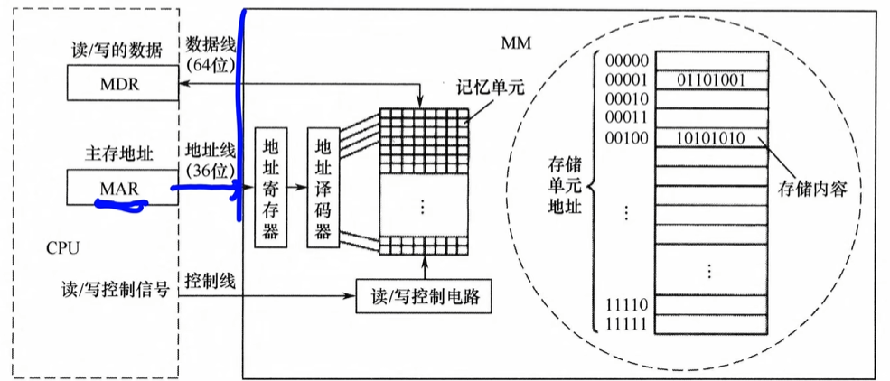
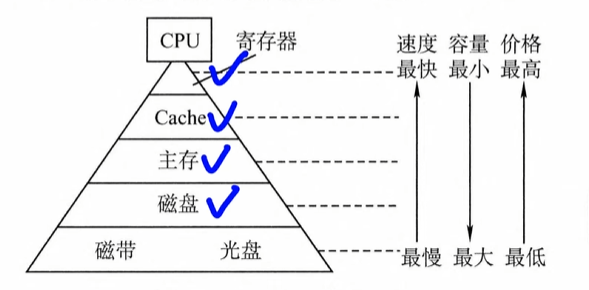
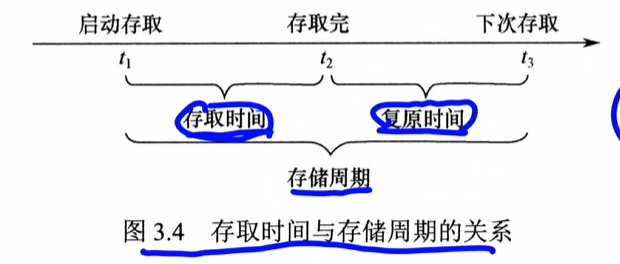
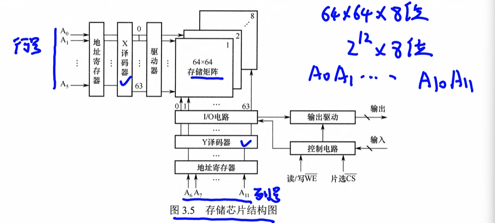
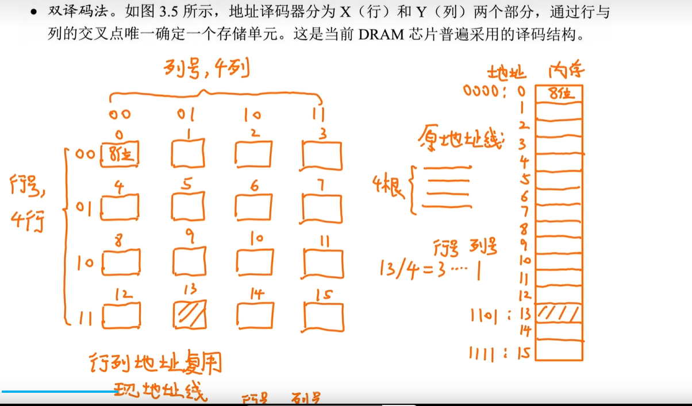
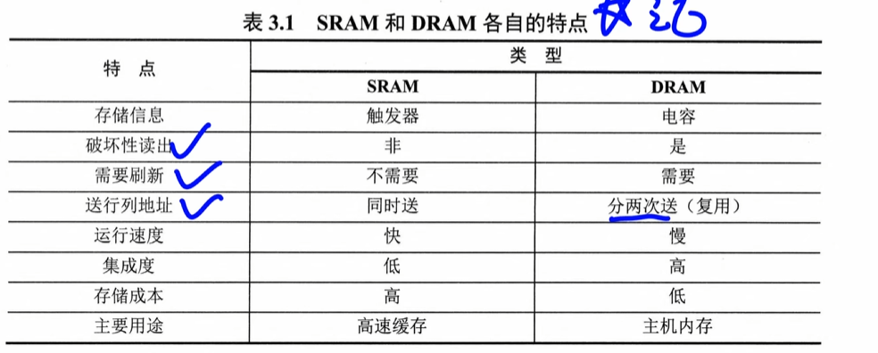

# 第三章存储

# 存储器的分类

##  存储元件

1.   半导体器件：半导体存储器DRAM，SRAM
2.   磁表面存储器：硬盘，磁带
3.   光存储器：光盘

## 存取方式

1.   随机存取存储器RAM：**可以随机访问**，半导体存储器属于这类，常用于主存和cache
2.   顺序存储存储器：**必须顺序存取**（链表），越靠前的数据访问时间越快，磁带属于这类，容量大，速度慢
3.   直接存取存储器：既可以随机访问，也可以按顺序读取数据，**属于12的集合体**，机械磁（硬）盘
4.   相联存储器：按内容存取，查找速度块，且与存储位置无关，但是成本高。块表（TLB）

## 按信息可更改性分类

1.   可读可写存储器RAM：
2.   只读存储器：ROM(通常不可修改)

两个都是随机存取的方式

## 按信息可保存性分类

1.   易失性存储器：RAM，内存
2.   非易失性存储器：ROM，Flash存储器，磁盘，光盘

# 主存储器的组成和基本操作

主存储器MM

 **作用：**存储二进制数0或1的记忆单元（存储元）

**编址单位：**具有相同地址的一组记忆单元，称为一个存储单元

## CPU访问一个地址

左边是CPU，右边是内存

[跳转到 MAR/MDR](./特有名词.md#MAR和MDR)

1.   MAR通过地址线送到地址寄存器，和地址译码器，找到存储单元

2.   同时，CPU通过控制先向主存发送读写信号

     1.   写：将待写的数据送到MDR,经过数据线写入
     2.   读：将选中的单元内容哦经过数据线送到MDR

# 存储器的层次化结构

1.   速度块，容量小，价格高

**三级存储系统的层次结构**

1.   CPU可以直接访问cache和主存(内存)，
2.   只有主存可以和辅存(外存)相互访问

1.   cache-主存层：主要用于缓解主存速度不匹配的问题
2.   主存-辅存层：解决容量不足的问题

 ## 概念

**存储周期：**存储器连续两次独立的读写操作所需时间最小间隔

**存储周期 = 存取时间 + 复原时间**

1.   存取时间≠存储周期

2.   每次读完还需要一定时间恢复（DRAM破坏性读出

     [破坏性读出](./存储周期.md)）

# 3.2主存

RAM分为**静态SRAM和动态DRAM**，均为易失性存储器

主存采用DRAM

Cache采用SRAM

**SRAM**

速度快，集成度低，功耗大，成本高

非破坏性，无需再生

**DRAM**

通过电容上的电荷存储信息，基本存储元仅由一个晶体管和一个电容构成，结构简单，集成度高

价格低，功耗小，容量大

速度慢，电荷会因为漏电而消失，必须定时刷新维持数据，**破坏性读出，读取后需要恢复**

刷新按行刷新，刷新时就是全读一遍

**行缓冲器**：使用SRAM实现

作用:可以存储一行中所有存储单元的数据总量

## 存储芯片的组成

1.   存储体(存储矩阵).是存储单元的集合
2.   地址译码器，将输入地址转换为电平信号，驱动读写电路
     1.   单译码法
     2.   双译码法
3.   I/O电路：控制读写，由放大信号
4.   片选控制线：可以控制哪些芯片被选中
5.   读写控制线：根据CPU发出的读写命令，通过读写控制线选择单元执行相应操作

### 单译码法

假设是4位

译码器把他翻译成0000 ...1111然后放到内存

缺点：译码器输出线太多了

### 双译码法

分为XY两部分，唯一确定一个存储单元

**行列地址复用**，只需要两条地址线

## 5. 同步DRAM

*在异步DRAM中，CPU发出地址和控制信号后，需要等待一段不确定的延迟时间，在这段时间，CPU不断轮询存储器的状态信号，不误执行其他任务*

**同步DRAM预设了若干时钟后完成返回数据或写入数据，不需要CPU轮询等待，可以在这段时间执行其他指令**

## SRAM和DRAM比较

